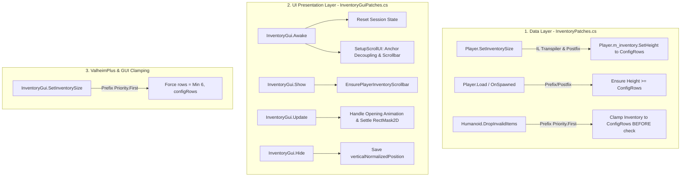

# ExpandedPlayerInventory - AI Agent Project Knowledge & Instructions

> **Project Identity**: Standalone Valheim BepInEx 5.x plugin that expands player inventory rows (up to 50 rows, default 20) with a native-themed scrollbar, smooth mouse-wheel scrolling, and gamepad navigation support.

---

## 1. Tech Stack & Environment

- **Target Framework**: .NET Framework 4.8 (`net48`), C# latest (`LangVersion: latest`), Nullable enabled (`<Nullable>enable</Nullable>`).
- **Mod Loader**: BepInEx 5.4.2202.
- **Patching Library**: HarmonyX 2.x (`0Harmony.dll`).
- **Game Engine**: Unity 2022.3 (UI, UGUI, RectTransform, RectMask2D, ScrollRect).
- **Primary Game Assemblies**: `assembly_valheim.dll` (or publicized variant), `assembly_guiutils.dll`, `UnityEngine.UI.dll`.

---

## 2. Codebase Map

| File | Role & Key Responsibilities |
| :--- | :--- |
| [Plugin.cs](Plugin.cs) | Plugin entry point (`BaseUnityPlugin`). Binds configuration entries, manages legacy config migration (`com.custom.expandedplayerinventory.cfg` -> `ckforgame.ExpandedPlayerInventory.cfg`), and triggers `Harmony.PatchAll()`. |
| [InventoryPatches.cs](InventoryPatches.cs) | **Data Layer**. Expands underlying inventory storage capacity. Injects IL Transpiler into `Player.SetInventorySize`. Prevents accidental item loss via `Humanoid.DropInvalidItems` Prefix. Enforces row persistence on `Player.Load` and `Player.OnSpawned`. Intercepts GUI container sizing via `InventoryGui.SetInventorySize`. |
| [InventoryGuiPatches.cs](InventoryGuiPatches.cs) | **UI Presentation Layer**. Manages Valheim inventory viewport. Decouples `m_playerGrid` anchors, attaches `RectMask2D`, clones Valheim native scrollbar (with fast programmatic fallback), sets up `ScrollRect` and `ScrollRectEnsureVisible` for controllers, handles opening animation settling, and remembers scroll position. |
| [ExpandedPlayerInventory.csproj](ExpandedPlayerInventory.csproj) | Project build specification. Resolves Steam and BepInEx reference assemblies dynamically. Defines project version. |
| [package-thunderstore.ps1](package-thunderstore.ps1) | Automated release packaging script. Compiles in Release mode, validates required files (icon, manifest, readme), and produces zip archive in `dist/`. |
| [manifest.json](manifest.json) | Thunderstore package manifest specifying name, version number, and dependencies. |
| [DEVELOPMENT.md](DEVELOPMENT.md) | Human-focused developer guide and architecture documentation. |
| [README.md](README.md) | User-facing documentation, installation guide, known issues, and changelog. |

---

## 3. Core Architecture & Workflow



---

## 4. Critical Invariants & Rules (Strictly Enforced)

### 1. Item Loss Prevention (Zero-Data-Loss Rule)
- **Invariant**: The player's data-layer inventory height (`m_inventory.GetHeight()`) must **never** be allowed to drop below `ExpandedPlayerInventoryPlugin.PlayerInventoryRows.Value`.
- **Reason**: In Valheim, `Humanoid.DropInvalidItems()` inspects whether items are outside `m_width * m_height`. If any mod or game system resets the inventory height to 4, all items beyond slot 32 will be ejected into the world and lost.
- **Rule**: `Humanoid_DropInvalidItems_Patch` runs at `[HarmonyPriority(Priority.First)]` to ensure inventory height is at least `configRows` before drop logic executes.

### 2. GUI Row Clamping (ValheimPlus Coexistence)
- **Invariant**: `InventoryGui.SetInventorySize` parameter `rows` must be clamped to `Math.Min(6, Math.Max(4, configRows))` via `InventoryGui_SetInventorySize_Patch`.
- **Reason**: Other mods (such as ValheimPlus) or game updates may attempt to set `InventoryGui.SetInventorySize(20)`. If the GUI container expands to 20 rows, the wooden panel expands off-screen, distorting the canvas and breaking the scrollbar.
- **Rule**: Data storage is 20 rows, but visible GUI container is always clamped to at most 6 rows. The remaining rows are accessed exclusively via scrolling.

### 3. RectMask2D Culling & Settle Timing
- **Invariant**: Never enable `RectMask2D` on `m_playerGrid` when `gridRect.rect.height <= 10f` or during frame 1 of inventory opening.
- **Reason**: Unity UI's canvas and layout animator scale up the inventory window over several frames. If `RectMask2D.PerformClipping()` runs while `worldHeight` or scale is 0, Unity's clipping rect becomes 0-height and culls all item slots (rendering a blank wooden board).
- **Rule**: In `InventoryGui_Update_Patch`, keep mask disabled during early opening frames, allow the animator/layout to settle (frame >= 2, scale >= 0.8), then call `LayoutRebuilder.ForceRebuildLayoutImmediate(gridRect)` and re-enable `mask.PerformClipping()`. Subsequent opens in the same session bypass this entirely (`_isWorldSessionInitialized = true`).

### 4. Anchor Decoupling & Stability
- **Invariant**: `m_playerGrid` RectTransform must be top-anchored:
  ```csharp
  gridRect.anchorMin = new Vector2(gridRect.anchorMin.x, 1f);
  gridRect.anchorMax = new Vector2(gridRect.anchorMax.x, 1f);
  gridRect.pivot = new Vector2(gridRect.pivot.x, 1f);
  ```
- **Reason**: Prevents parent layout groups or container resizes (e.g. opening chests) from stretching or collapsing the player grid viewport height.

### 5. Memory Heap & GC Allocations (Performance Guard)
- **Invariant**: Do **not** call `Resources.FindObjectsOfTypeAll<Scrollbar>()` during gameplay or initialization.
- **Reason**: It causes a full managed heap traversal that introduces a 50–500ms stutter/frame drop.
- **Rule**: Search existing scene hierarchies (`gui.m_recipeListScroll`, `gui.m_containerGrid`, `gui.GetComponentInChildren<Scrollbar>(true)`). If not found, immediately invoke the lightweight `CreateProgrammaticScrollbar(parent)` fallback (< 0.1ms).

### 6. Component Caching in `Update()`
- **Invariant**: Never perform `GetComponent<RectTransform>()`, `GetComponent<RectMask2D>()`, or `GetComponent<ScrollRect>()` every frame.
- **Rule**: Use the static cached references in `InventoryGui_Show_Patch` (`_cachedGridRect`, `_cachedMask`, `_cachedScrollRect`). Bail out immediately in `Update` if the inventory animator `visible` flag is false.

---

## 5. Build, Test & Release Playbook

### Build Commands
```powershell
# Debug build
dotnet build -c Debug

# Release build
dotnet build -c Release
```

### Automated Thunderstore Packaging
```powershell
# Runs Release build, verifies assets, and packages into dist/ExpandedPlayerInventory-vX.Y.Z.zip
powershell -ExecutionPolicy Bypass -File .\package-thunderstore.ps1
```

### Version Bump Synchronization (Mandatory: 3 Locations)
When creating a new release or bumping versions, you must update the version string in all 3 locations synchronously:
1. `ExpandedPlayerInventory.csproj`: `<Version>X.Y.Z</Version>`
2. `Plugin.cs`: `public const string ModVersion = "X.Y.Z";`
3. `manifest.json`: `"version_number": "X.Y.Z"`

---

## 6. How to Extend the Mod

### Adding a New Configuration Entry
1. Add static property in [Plugin.cs](Plugin.cs):
   ```csharp
   public static ConfigEntry<T> MySetting { get; private set; } = null!;
   ```
2. Bind in `Awake()`:
   ```csharp
   MySetting = Config.Bind("Section", "settingKey", defaultValue, new ConfigDescription("Description."));
   ```
3. Update [README.md](README.md) with configuration details.

### Adding a Harmony Patch
1. Create a patch class with `[HarmonyPatch(typeof(TargetClass), nameof(TargetClass.TargetMethod))]`.
2. Always wrap patch bodies in `try ... catch (Exception e)` and log via `ExpandedPlayerInventoryPlugin.Log.LogError(...)` so exceptions never crash the game.
3. Be mindful of patch priority (`[HarmonyPriority(Priority.First)]` or `Priority.Low`) when coordinating with other mods or Valheim engine routines.
