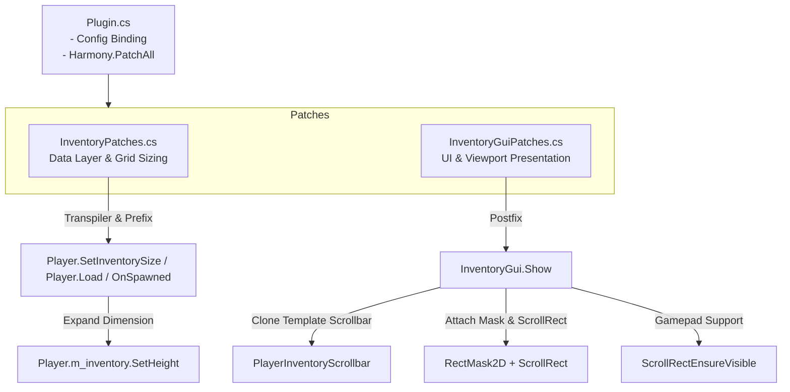

# ExpandedPlayerInventory - Development Guide

This guide details the mod's architecture, local environment setup, testing workflow, feature extension guidelines, and release procedures for **ExpandedPlayerInventory**.

---

## 1. Architecture Overview

This mod runs as a **BepInEx 5.x plugin** for Valheim, utilizing **HarmonyX** for runtime bytecode and execution patching:



### Component Breakdown
- **[Plugin.cs](Plugin.cs)**:
  - Mod entry point inheriting from `BaseUnityPlugin`.
  - Defines `ModGuid`, `ModName`, and `ModVersion`.
  - Binds configuration entries (`playerInventoryRows`), persisting them to `BepInEx/config/com.custom.expandedplayerinventory.cfg`.
  - Executes `Harmony.PatchAll()` on startup and `UnpatchSelf()` on destruction.
- **[InventoryPatches.cs](InventoryPatches.cs)**:
  - Controls and expands the player's inventory height (rows) at the data layer.
  - Employs an **IL Transpiler** within `Player.SetInventorySize` to inject row overrides before game systems allocate grid space.
  - Uses `Prefix` and `Postfix` patches on `Player.Load` and `Player.OnSpawned` to ensure character persistence always respects the configured inventory row height.
- **[InventoryGuiPatches.cs](InventoryGuiPatches.cs)**:
  - Controls runtime Unity UI presentation and viewport interactions.
  - Dynamically attaches a `RectMask2D` onto `m_playerGrid` to cleanly clip offscreen inventory slots.
  - Clones a native Valheim scrollbar template (from `m_recipeListScroll`, `m_containerGrid`, etc.), scales it, and positions it along the right side of the player inventory frame.
  - Attaches and configures a `ScrollRect` linking the scrollbar to enable mouse-wheel scrolling.
  - Attaches `ScrollRectEnsureVisible` to provide seamless gamepad/controller scrolling support.
- **[package-thunderstore.ps1](package-thunderstore.ps1)**:
  - Automated PowerShell packaging script that compiles in Release mode, validates required assets, ensures UTF-8 without BOM for markdown/json files, and creates an upload-ready `.zip` archive in the `dist/` directory.

---

## 2. Prerequisites & Setup

### Requirements
1. **.NET SDK** (with support for targeting .NET Framework 4.8).
2. **Visual Studio 2022** (with *.NET desktop development* workload), **JetBrains Rider**, or **VS Code** with C# Dev Kit.
3. **Valheim** installed via Steam.
4. **BepInExPack Valheim** installed in your game directory or active r2modman profile.

### Assembly References in [ExpandedPlayerInventory.csproj](ExpandedPlayerInventory.csproj)
The project automatically resolves game assemblies and BepInEx binaries using conditional paths:
```xml
<ValheimPath Condition="!Exists('$(ValheimPath)')">C:\Program Files (x86)\Steam\steamapps\common\Valheim</ValheimPath>
<ValheimPath Condition="!Exists('$(ValheimPath)')">C:\Program Files\Steam\steamapps\common\Valheim</ValheimPath>
<BepInExCore Condition="!Exists('$(BepInExCore)')">$(AppData)\r2modmanPlus-local\Valheim\profiles\Jan2026\BepInEx\core</BepInExCore>
<BepInExCore Condition="!Exists('$(BepInExCore)')">$(ValheimPath)\BepInEx\core</BepInExCore>
```

> [!TIP]
> If your game or BepInEx installation resides on a custom drive or path, you can specify it during build:
> ```powershell
> dotnet build -p:ValheimPath="E:\SteamLibrary\steamapps\common\Valheim"
> ```

---

## 3. Development & Testing Workflow

### 1) Building via Terminal
```powershell
# Debug build for local testing
dotnet build -c Debug

# Release build for distribution
dotnet build -c Release
```

### 2) Deploying Locally for Testing
Copy the compiled binary:
```text
bin\Release\ExpandedPlayerInventory.dll
```
To your BepInEx plugins folder:
```text
<Valheim_Directory>\BepInEx\plugins\ExpandedPlayerInventory.dll
```

### 3) Live Debug Logging
To monitor mod logs in real time, open `<Valheim_Directory>\BepInEx\config\BepInEx.cfg` and enable the console:
```ini
[Logging.Console]
Enabled = true
```
All messages invoked via `ExpandedPlayerInventoryPlugin.Log.LogInfo(...)` or `LogError(...)` will appear in the BepInEx console window during gameplay.

---

## 4. Extending Features

### Adding a New Configuration Option
1. Open [Plugin.cs](Plugin.cs).
2. Declare the `ConfigEntry` property:
   ```csharp
   public static ConfigEntry<float> ScrollSensitivity { get; private set; } = null!;
   ```
3. Bind the entry in `Awake()`:
   ```csharp
   ScrollSensitivity = Config.Bind(
       "UI",
       "scrollSensitivity",
       70.5f,
       new ConfigDescription("Scroll sensitivity for inventory grid mouse-wheel scrolling.")
   );
   ```
4. Reference the value wherever needed (e.g., inside [InventoryGuiPatches.cs](InventoryGuiPatches.cs)):
   ```csharp
   scrollRect.scrollSensitivity = ExpandedPlayerInventoryPlugin.ScrollSensitivity.Value;
   ```

---

### Adding a New Harmony Patch
Standard structure for patching Valheim classes:
```csharp
using HarmonyLib;

namespace ExpandedPlayerInventory
{
    [HarmonyPatch(typeof(TargetClass), nameof(TargetClass.TargetMethod))]
    public static class TargetClass_TargetMethod_Patch
    {
        // Executes prior to original method. Returning false skips original method execution.
        [HarmonyPrefix]
        public static void Prefix(TargetClass __instance)
        {
            // Custom logic
        }

        // Executes following original method completion.
        [HarmonyPostfix]
        public static void Postfix(TargetClass __instance)
        {
            // Custom logic
        }
    }
}
```

---

## 5. Release Checklist

Follow these steps when preparing an update or release:

1. **Bump Version (3 Locations)**:
   - [ExpandedPlayerInventory.csproj](ExpandedPlayerInventory.csproj): `<Version>X.Y.Z</Version>`
   - [Plugin.cs](Plugin.cs): `public const string ModVersion = "X.Y.Z";`
   - [manifest.json](manifest.json): `"version_number": "X.Y.Z"`
2. **Update [README.md](README.md)**: Document new features, configuration changes, or bug fixes.
3. **Execute Packaging Script**:
   ```powershell
   .\package-thunderstore.ps1
   ```
4. **Validate Artifacts**: Ensure the `.zip` archive was generated cleanly in `dist/`.
5. **Commit & Push**:
   ```powershell
   git add .
   git commit -m "Release vX.Y.Z: Summary of changes"
   git push
   ```
6. **Upload to Thunderstore**: Upload the resulting zip package directly at [valheim.thunderstore.io](https://valheim.thunderstore.io/).
